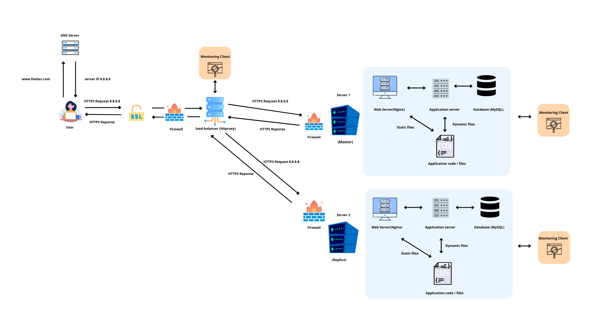

# Secured and Monitored Web Infrastructure  

## Infrastructure Design  

The infrastructure consists of **three servers** that host the website `www.foobar.com`:  

- **1 Load Balancer (HAProxy)**  
- **2 Web/Application/Database servers**  

### Additional Elements  
- **3 Firewalls** (one in front of each server)  
- **1 SSL certificate** to serve `www.foobar.com` over HTTPS  
- **3 Monitoring clients** (data collectors such as Sumo Logic agent, Datadog agent, or Prometheus exporters)  

---

## Elements and Purpose  

- **Firewalls:**  
  Restrict access by allowing only necessary ports and protocols. For example, only port 80/443 is exposed to the public, and MySQL is only accessible from the application servers.  

- **SSL certificate:**  
  Encrypts traffic to ensure confidentiality, integrity, and authentication between client and server.  

- **Monitoring clients:**  
  Collect metrics (CPU, memory, network, QPS) and logs, then send them to a central monitoring service for visualization and alerting.  

---

## Why Each Element  

- **Firewalls:** Prevent unauthorized access and reduce the attack surface.  
- **HTTPS (SSL certificate):** Protects user data from being intercepted or modified.  
- **Monitoring:** Provides visibility into the system, helps detect issues early, and enables alerting.  

---

## Monitoring Details  

- **How monitoring works:**  
  Agents run on each server, collecting metrics and logs. They forward this data to a monitoring backend (e.g., Sumo Logic, Datadog, Prometheus + Grafana).  

- **Monitoring web server QPS:**  
  - Enable Nginx status module or use log collectors to measure requests per second.  
  - Monitoring tools query these metrics and display them in dashboards.  
  - Alerts can be configured if QPS exceeds a defined threshold.  

---

## Issues with This Infrastructure  

1. **SSL termination at the load balancer:**  
   - If SSL is terminated at the load balancer, traffic between the load balancer and backend servers may be unencrypted, creating a potential security risk.  

2. **Single writable MySQL server:**  
   - Having only one Primary node creates a Single Point of Failure (SPOF). If it fails, no writes can be performed until failover is configured.  

3. **All-in-one servers (Web + App + DB):**  
   - Hard to scale individual layers independently.  
   - Resource contention between application and database processes.  
   - Operational complexity for backups and updates.  

---

## Diagram  

