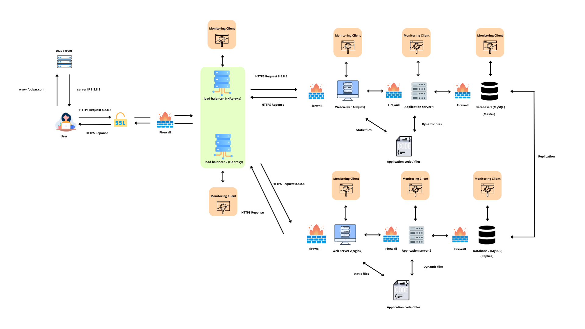

# Scale up Infrastructure

## Additional Elements

- **1 new server**: Increases the capacity of the infrastructure.  
- **Load Balancer Cluster (HAProxy x2)**: Ensures redundancy; if one load balancer fails, the other can continue to serve requests.  
- **Split components**:  
  - **Web Server (Nginx)**: Handles HTTP requests, serves static files, forwards dynamic requests to the application server.  
  - **Application Server**: Processes business logic, interacts with the database.  
  - **Database Server (MySQL)**: Stores and retrieves persistent data.  

---

## Why these elements are added

- **New server**: To handle more traffic and improve reliability.  
- **Load Balancer Cluster**: Avoids SPOF (Single Point of Failure).  
- **Component separation**: Improves scalability, maintainability, and performance by dedicating each server to a specific role.  

---

## Key Concepts

### Web Server vs Application Server
- **Web Server**: Delivers static content and forwards requests for dynamic content.  
- **Application Server**: Runs the application code and generates dynamic content.  

### Database Server
- Dedicated machine for handling queries and storing data.  

---

## Benefits of this Architecture

- **Scalability**: Each component can be scaled independently.  
- **Reliability**: Redundancy with multiple load balancers.  
- **Maintainability**: Easier to manage and troubleshoot when roles are separated.

---

## Diagram  

